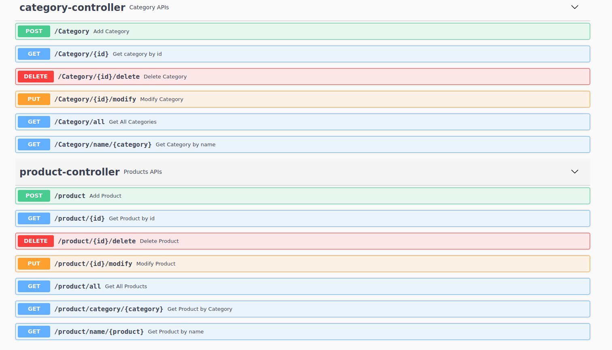

# Product and Category Challenge WebService 


### What is this repository for? ###

* This microservice is for managing product and category (CRUD).

### How do I get set up? ###

* Clone your project 
```sh
$ git clone https://github.com/Vvoox/imedia_24.git
$ cd imedia_24
$ ./mvnw
```

### How do I get set up using Docker ###

* After installing [Docker](https://docs.docker.com/docker-for-windows/install/)

```sh
$ docker pull vvoox/imedia_24:latest
$ docker run -p yourport:yourport -t tagName
$ docker ps (to check your container)
```
### Run Docker using Dockerfile ###

* Create Dockerfile in your repo:
```sh
FROM openjdk:8-jdk-alpine
ARG JAR_FILE=target/*.jar
COPY ${JAR_FILE} app.jar
ENTRYPOINT ["java","-jar","/app.jar"]
```
### In case your have multiple WebServices ###

* Use [Docker Compose](https://docs.docker.com/compose/install/) .

### Run Docker using Docker-compose.yaml ###

* create Docker-compose.yaml in your repo :
```sh
version: '2'
services:
  challenge-service :
    image: tagName
    ports:
      - "yourport:yourport"
      
    <Other services bellow>
```

### API Documentation ###

* Run your project
* Open [http://localhost:yourport/swagger-ui/#](http://localhost:yourport/swagger-ui/#)




